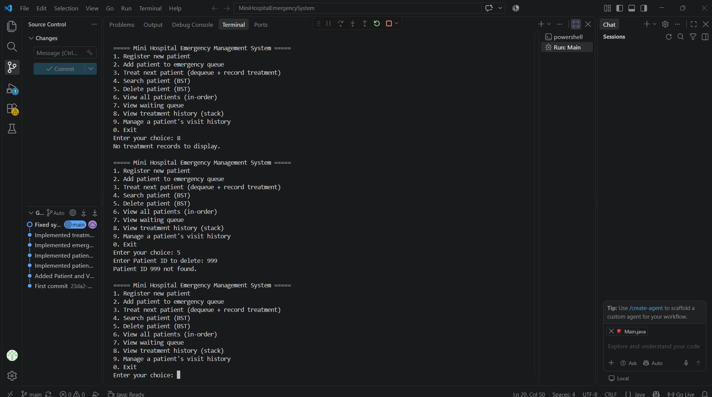

# Mini Hospital Emergency Management System

CIT300 Data Structures Assignment — a Java console application that manages hospital patient records, emergency queues, treatment history, and visit history using data structures.

## Features

PatientBST (Binary Search Tree) — Patients are stored in a BST keyed by Patient ID, allowing efficient insertion and search. EmergencyQueue.java - Managing patients waiting for emergency treatment (FIFO).  TreatmentStack.java - Recording completed treatments, most recent first (LIFO). VisitLinkedList.java - Storing each patient's visit history. 

## Options

Running Main,java presents the following menu :
1. Add new patient
2. Search patient by ID
3. Treat next patient
4. Delete patient
5. Add patient to emergency queue
6. View waiting queue
7. View treatment history entry
8. View all patients (Sorted by ID)
9. Exit

## Screenshots

### Adding Patients

### Patient Deletion Testing and viewing all patients

### Edge Case & Structural Testing

## Technologies used 

- **Language:** Java
- **IDE:** VS code

## Project details

- CIT 300 - Data Structures and Algorithms  (Mid Assignment)
- Student ID : 23DA2-0148
- Student Name : J.P.A.J.Patabadige
